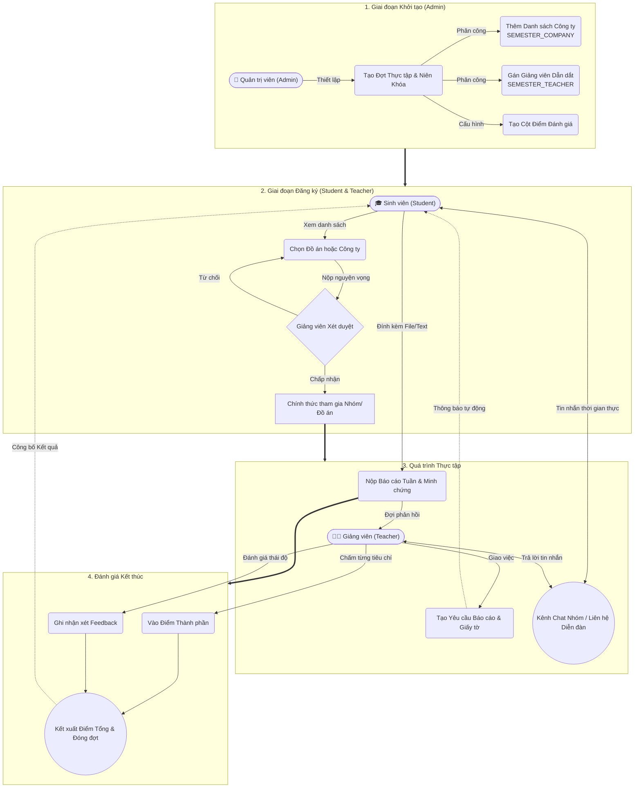
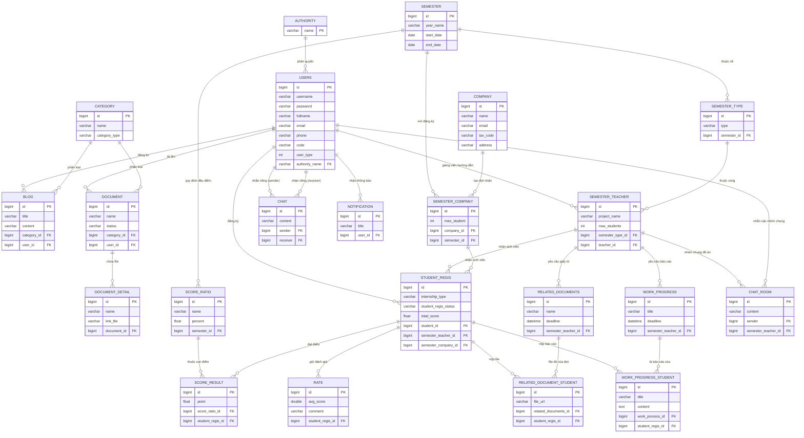

# Hệ Thống Quản Lý Đồ Án Thực Tập (Internship Management System)

Dự án **Quản lý Đồ án - Thực tập sinh viên** là một nền tảng Web Application toàn diện, nhằm mục đích số hóa và tối ưu hóa toàn bộ quy trình thực tập của sinh viên tại các trường Đại học/Cao đẳng. 

Hệ thống kết nối trực tiếp 3 vai trò chính: **Quản trị viên (Admin)**, **Giảng viên hướng dẫn (Teacher)** và **Sinh viên (Student)**. Từ việc đăng ký nguyện vọng, tìm kiếm doanh nghiệp, báo cáo tiến độ hàng tuần, trao đổi trực tuyến (Real-time Chat), cho đến thao tác nộp duyệt tài liệu và chấm điểm cuối khóa.

---

## 🌟 Chức Năng Nổi Bật

Hệ thống phân quyền truy cập chặt chẽ với những tính năng chuyên biệt cho từng đối tượng:

### 1. Dành cho Sinh Viên (Student)
- 🏢 **Thông tin doanh nghiệp:** Tra cứu danh sách công ty, thông tin tuyển dụng thực tập do nhà trường liên kết hoặc tự tìm kiếm ngoài.
- 📝 **Đăng ký đồ án/thực tập:** Nộp đơn đăng ký thực tập (Tại trường / Liên kết doanh nghiệp / Tự túc).
- 📈 **Báo cáo tiến độ:** Nộp tài liệu, báo cáo tuần, và nhận feedback trực tiếp từ giảng viên.
- 💬 **Thảo luận trực tuyến (Chat):** Kênh chat thời gian thực (Real-time) để trao đổi nhanh với Giảng viên và nhóm làm việc.
- 🌙 **Cá nhân hóa:** Quản lý thông tin hồ sơ cá nhân, đổi mật khẩu và tuỳ biến giao diện sáng/tối (Dark Mode).

### 2. Dành cho Giảng Viên (Teacher)
- 👥 **Quản lý nhóm sinh viên:** Xét duyệt danh sách sinh viên đăng ký, theo dõi số lượng và tiến độ.
- 📊 **Tiếp nhận & Đánh giá báo cáo:** Duyệt các tài liệu, báo cáo tiến độ tuần từ sinh viên và cho điểm đánh giá.
- 💬 **Tương tác trực tiếp:** Trả lời tin nhắn, thông báo nhắc nhở nội bộ nhanh chóng qua WebSocket Chat.
- 📰 **Tin tức & Thông báo:** Quản trị các bài đăng blog, bản tin nội bộ gửi tới sinh viên.

### 3. Dành cho Quản Trị Viên (Admin)
- 🗄️ **Quản lý tài khoản:** Thêm/sửa/xoá/phân quyền User. Hỗ trợ tính năng Import danh sách hàng loạt (Import Excel).
- 🏫 **Quản lý danh mục cốt lõi:** Quản lý Niên khóa/Năm học, Danh mục điểm, Ngành/Lớp, Doanh nghiệp.
- 📰 **Quản trị nội dung:** Phê duyệt hoặc soạn thảo các bài đăng Thông báo, Tin tức, Banner hệ thống.
- ⚙️ **Nhật ký & Cài đặt:** Theo dõi nhật ký hoạt động (System Logs), tuỳ chỉnh cấu hình toàn trang (Theme, Cài đặt hệ thống).

---

## 💻 Công Nghệ Sử Dụng (Tech Stack)

Dự án được xây dựng trên mô hình nguyên khối **Monolithic** với các công nghệ mạnh mẽ và hiện đại:

**Back-end:**
- **Java Spring Boot 3+**: Framework chính.
- **Spring Data JPA / Hibernate**: Tương tác và thao tác cơ sở dữ liệu.
- **Spring Security**: Xác thực, định danh và phân quyền bằng JWT / Session.
- **Spring WebSocket / STOMP**: Giao tiếp thời gian thực (Tính năng Chat).

**Front-end:**
- **Thymeleaf**: Template Engine cho phép nhúng dữ liệu vào HTML cực kỳ linh hoạt.
- **Bootstrap 5.3**: Xây dựng UI/UX chuyên nghiệp, Responsive, Native Dark mode.
- **Vanilla JS / jQuery**: Xử lý logic phía client và thực hiện gọi API (Fetch, Ajax).
- **Libraries khác**: TinyMCE (Rich Text Editor), SweetAlert, Select2, Toastr.

**Database & Dịch vụ ngoài:**
- **MySQL**: Hệ quản trị cơ sở dữ liệu quan hệ (Relational Database Server).
- **Cloudinary**: Dịch vụ lưu trữ file Media, hình ảnh, tài liệu tĩnh.

---

## 🏗️ Sơ Đồ Luồng Nghiệp Vụ (Business Flow Diagram)

Dưới đây là chuỗi hành động (Sequence) từ lúc Bắt đầu đợt thực tập cho đến lúc Chấm điểm kết thúc. Được mô phỏng bằng ngôn ngữ sơ đồ Mermaid.



---

## 🗄️ Cấu Trúc Cơ Sở Dữ Liệu & ERD Diagram

Hệ thống được thiết kế hoàn chỉnh với 22 bảng (Tables), quy hoạch thành các khối nghiệp vụ như phân quyền, tương tác tiến độ, lưu trữ hành chính và trao đổi thông tin nội bộ.

### Sơ Đồ Thực Thể - Liên Kết (Entity-Relationship Diagram)



### Phân Tích Chức Năng Cốt Lõi Của Database

- **1. Nhóm Quản Trị Hệ Thống (`users`, `authority`):** Lưu trữ tài khoản và phân quyền người dùng (roles).
- **2. Nhóm Cấu Hình Đợt Thực Tập (`semester`, `semester_type`, `semester_teacher`, `semester_company`, `company`):** Cấu hình thời hạn, quy chế và số lượng sinh viên cho từng Giảng viên hoặc Doanh nghiệp theo niên khóa tương ứng.
- **3. Nhóm Đăng Ký Của Sinh Viên (`student_regis`):** Đây là bảng cầu nối quan trọng (Core). Mỗi cá nhân sẽ lưu lại lịch sử đăng kí của mình kết nối tới Giảng viên hoặc Công ty. Bao gồm điểm số tổng.
- **4. Nhóm Báo Cáo, Nộp Tài Liệu (`work_progress`, `work_progress_student`, `related_documents`, `related_document_student`):** Ứng với từng yêu cầu từ Giảng viên, sinh viên sẽ gửi nội dung và file (URL) lên thông qua bảng `..._student`.
- **5. Nhóm Điểm Số, Đánh Giá (`score_ratio`, `score_result`, `rate`):** Định nghĩa tỷ trọng cột điểm, cho tiết lưu lại điểm trên từng dòng của sinh viên và đánh giá nhận xét sau kết thúc.
- **6. Nhóm Tương Tác, Giao Tiếp (`chat`, `chat_room`, `notification`, `blog`, `category`, `document`, `document_detail`):** Quản lý luồng trò chuyện 1-1 và làm việc nhóm đồ án. Đồng thời phân loại các bản tin, trang thư viện của nhà trường.

---

## 📂 Cấu Trúc Thư Mục Chuyên Sâu

```text
quanlydoan/
├── src/main/java/             # Source code cốt lõi Backend (Controller, Service, Repository, Entity, Configuration...)
├── src/main/resources/        # File cấu hình ứng dụng application.properties, các file tĩnh (static resources)
├── src/main/webapp/           # Các Frontend Resources (Dành riêng cho web MVC)
│   ├── admin/js/              # Javascript xử lý nội bộ luồng Admin
│   ├── student/js/            # Javascript xử lý nội bộ luồng Student 
│   ├── teacher/js/            # Javascript xử lý nội bộ luồng Teacher
│   ├── css/                   # Stylesheets dùng chung, thư viện xử lý Native Dark/Light Mode (main.css, styleadmin.css)
│   └── views/                 # Chứa tất cả các trang giao diện HTML (.html) được build theo Thymeleaf fragment
│       ├── admin/             # Các màn quản trị của Admin
│       ├── student/           # Các màn chức năng cho Sinh viên 
│       ├── teacher/           # Màn chức năng cho Giảng viên hướng dẫn
│       └── common/            # Tái sử dụng HTML: Layout header, footer, thanh sidebar, module popup Chat
└── quanlydoan.sql             # Script Database hoàn thiện (Bao gồm dữ liệu mẫu Seed Data)
```

---

## 🛠️ Hướng Dẫn Cài Đặt Khởi Chạy (Setup Guide)

1. **Chuẩn bị môi trường:**
    - Cài đặt Java Development Kit (JDK) 17 trở lên.
    - Cài đặt MySQL Server / Workbench.
    - Clone ứng dụng qua Git về IDE của bạn.
    - Lấy thông tin API Keys từ dịch vụ **Cloudinary** để hỗ trợ upload File PDF, Word, Ảnh qua hệ thống.

2. **Thiết lập Database:**
    - Truy cập MySQL, khởi tạo một Database rỗng tên `quanlydoan` (hoặc tên theo ý định của bạn).
    - Import hoặc chạy mã `quanlydoan.sql` để sinh các Table và đổ Database mốc (Data Seeds).

3. **Cấu hình Spring Boot Application:**
    - Đi tới `src/main/resources/application.properties`.
    - Điều chỉnh lại chuỗi cấp phép DB: `spring.datasource.url`, `username`, `password` sao cho khớp với Local của bạn.
    - Thêm Config Auth của Cloudinary.

4. **Biên dịch & Chạy Server:**
    - Tìm file Controller main `QuanlydoanApplication.java` và khởi chạy dưới tư cách 1 Spring Boot App.
    - Server sẽ Start trên port mặc định `8080`.
    - Mở trình duyệt Web tại Link: `http://localhost:8080`
    
---
*Dự án thuộc dạng phần mềm học thuật (Academic Project / Capstone) được lên thiết kế theo đúng quy chuẩn ứng dụng Quản lý trường học.*