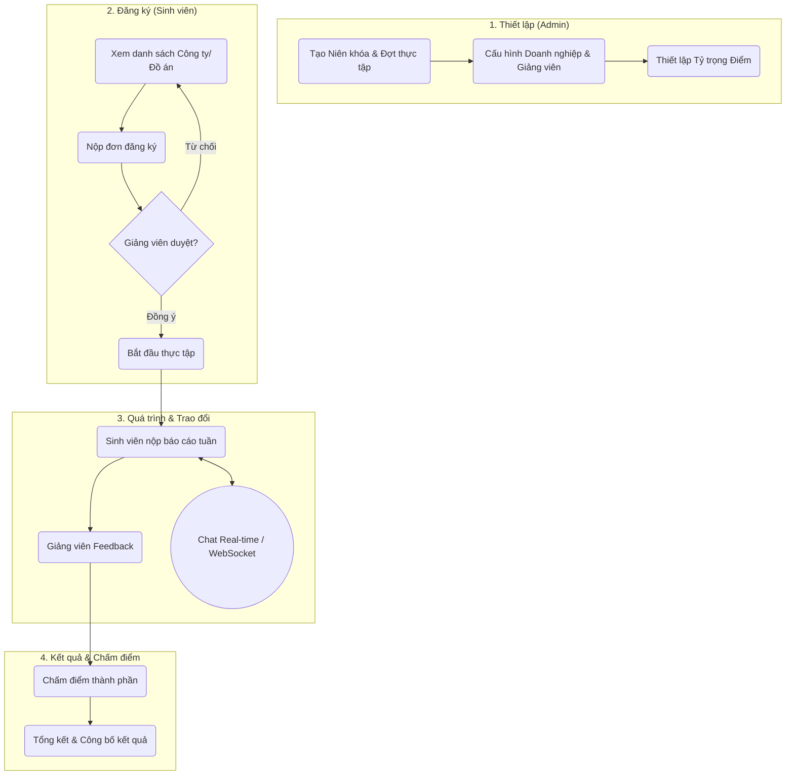
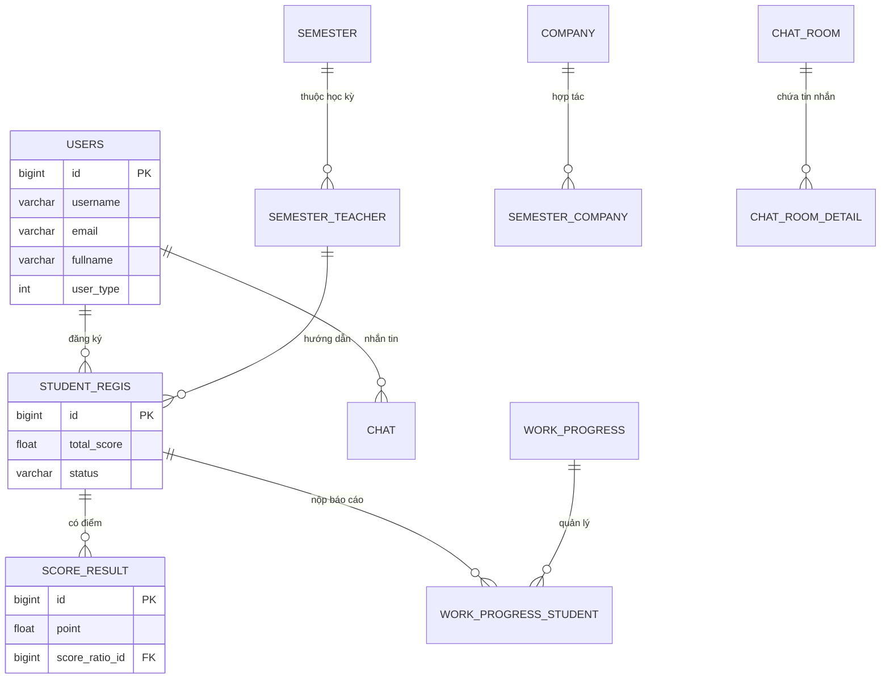

# 🎓 Hệ Thống Quản Lý Đồ Án & Thực Tập (Internship Management System)

[](https://openjdk.org/)
[](https://spring.io/projects/spring-boot)
[](https://www.mysql.com/)
[](https://www.thymeleaf.org/)
[](https://getbootstrap.com/)
[](https://opensource.org/licenses/MIT)

Dự án **Quản lý Đồ án - Thực tập sinh viên** là một giải pháp Web Application toàn diện, được thiết kế để số hóa và tối ưu hóa quy trình quản lý thực tập tại các trường đại học. Hệ thống giải quyết các thách thức trong việc kết nối giữa Nhà trường, Giảng viên, Sinh viên và Doanh nghiệp trên một nền tảng duy nhất.

---

## 🚀 Tính Năng Cốt Lõi

Hệ thống được phân quyền chặt chẽ với 4 vai trò chính, mỗi vai trò sở hữu bộ công cụ đặc thù:

### 🎓 Dành cho Sinh Viên (Student)
- **Đăng ký linh hoạt**: Đăng ký thực tập theo 3 hình thức: *Tại trường*, *Hợp tác doanh nghiệp* hoặc *Tự tìm kiếm*.
- **Quản lý tiến độ**: Nộp báo cáo tuần, tài liệu chuyên đề và theo dõi phản hồi từ giảng viên.
- **Tương tác Real-time**: Chat trực tiếp với giảng viên hướng dẫn và nhóm làm việc thông qua hệ thống WebSocket.
- **Hồ sơ & Cá nhân hóa**: Quản lý thông tin cá nhân, CV và hỗ trợ giao diện **Dark Mode** chuyên nghiệp.

### 👨‍🏫 Dành cho Giảng Viên (Teacher)
- **Quản lý nhóm hướng dẫn**: Xét duyệt danh sách sinh viên, phân công công việc và theo dõi lộ trình thực tập.
- **Đánh giá đa tiêu chí**: Chấm điểm dựa trên các cột điểm thành phần (Ratio-based), đưa ra nhận xét chi tiết.
- **Thông báo & Blog**: Đăng tải tin tức, hướng dẫn và tài liệu quan trọng cho sinh viên.
- **Giao tiếp thuận tiện**: Nhắn tin 1-1 hoặc chat nhóm đồ án tức thì.

### 👑 Dành cho Quản Trị Viên (Admin)
- **Quản trị hệ thống**: Quản lý người dùng, phân quyền (RBAC), import dữ liệu hàng loạt từ **Excel**.
- **Cấu hình đào tạo**: Thiết lập niên khóa, đợt thực tập, danh mục điểm và danh sách doanh nghiệp liên kết.
- **Giám sát hoạt động**: Theo dõi nhật ký hệ thống (System Logs) và quản trị nội dung (Banner, Blog, Tin tức).

### 🏢 Dành cho Doanh Nghiệp (Company)
- **Tiếp nhận sinh viên**: Quản lý danh sách sinh viên thực tập tại đơn vị.
- **Phối hợp đánh giá**: Gửi phản hồi về thái độ và kết quả làm việc của sinh viên về nhà trường.

---

## 🛠️ Công Nghệ Sử Dụng (Tech Stack)

Dự án sử dụng kiến trúc **Monolithic** hiện đại, kết hợp giữa Server-side Rendering và REST API:

- **Backend**: 
  - Java 17 + Spring Boot 2.7.12
  - Spring Security (JWT + **OAuth2 Google Login**)
  - Spring Data JPA + Hibernate
  - WebSocket (STOMP + SockJS) cho tính năng Real-time Chat.
- **Frontend**: 
  - Thymeleaf Template Engine
  - Bootstrap 5.3 + jQuery
  - Vanilla JS cho các tương tác nâng cao.
- **Database & Storage**:
  - MySQL 8.0 (Relational Database)
  - **Cloudinary API**: Lưu trữ và quản lý file/hình ảnh đám mây.
  - **Firebase Admin SDK**: Hỗ trợ các tính năng mở rộng.
- **Tiện ích**: 
  - Apache POI (Xử lý Excel), Java Mail Sender, Springdoc OpenAPI (Swagger).

---

## 🏗️ Kiến Trúc Hệ Thống

### 🌊 Luồng Nghiệp Vụ Chính (Business Flow)



### 🗄️ Sơ Đồ Cơ Sở Dữ Liệu (ERD)

Hệ thống bao gồm 23 bảng được thiết kế chuẩn hóa, tập trung vào việc quản lý quan hệ đa chiều giữa Sinh viên, Giảng viên và Đơn vị thực tập.


*(Xem chi tiết sơ đồ ERD đầy đủ tại tệp: [sơ đồ ERD.png](file:///c:/Users/TienSon/Desktop/project/quanlydoan/sơ đồ ERD.png))*

---

## 📂 Cấu Trúc Dự Án

```text
quanlydoan/
├── src/main/java/com/web/
│   ├── api/             # RESTful API Controllers
│   ├── controller/      # Web Controllers (Thymeleaf)
│   ├── entity/          # Cấu trúc Database (JPA)
│   ├── service/         # Logic nghiệp vụ
│   ├── config/          # Cấu hình Security, Cloudinary, WebSocket
│   └── dto/             # Data Transfer Objects
├── src/main/resources/
│   ├── static/          # CSS, JS, Images tĩnh
│   └── application.properties # Cấu hình hệ thống
└── src/main/webapp/views/ # Giao diện HTML (Thymeleaf)
```

---

## 🛠️ Hướng Dẫn Cài Đặt

### 1. Chuẩn Bị
- **JDK 17 +**
- **MySQL 8.0 +**
- **Maven 3.x**
- Tài khoản **Cloudinary** (để upload file).

### 2. Cấu Hình Cơ Sở Dữ Liệu
1. Tạo database: `CREATE DATABASE quanlydoan;`
2. Import tệp `quanlydoan.sql` để có cấu trúc bảng và dữ liệu mẫu.

### 3. Cấu Hình Ứng Dụng
Chỉnh sửa file `src/main/resources/application.properties`:
```properties
# Database Config
spring.datasource.url=jdbc:mysql://localhost:3306/quanlydoan
spring.datasource.username=YOUR_USERNAME
spring.datasource.password=YOUR_PASSWORD

# Cloudinary Config
cloudinary.cloud_name=YOUR_CLOUD_NAME
cloudinary.api_key=YOUR_API_KEY
cloudinary.api_secret=YOUR_API_SECRET
```

### 4. Khởi Chạy
- Chạy ứng dụng từ file `QuanlydoanApplication.java` hoặc sử dụng lệnh:
  ```bash
  mvn spring-boot:run
  ```
- Truy cập tại: `http://localhost:8080`

---
> [!TIP]
> Hệ thống hỗ trợ đăng nhập bằng tài khoản Google. Để kích hoạt, bạn cần cấu hình `Client ID` và `Client Secret` trong phần cấu hình OAuth2.

---
*Dự án thực hiện nhằm phục vụ mục đích học tập và quản lý đào tạo chuyên sâu.*